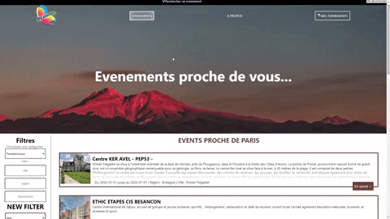

# 🚗 MY_EVENT | ReactJS NodeJS📅
  
  ----------------  

This project aims to regroup the events near your location using an external API.
    
`Start the project :`  
```
Front end folder :
npm install
npm run start

Back end folder :
npm install
npm run start
```
<p align="center">
    
</p>
